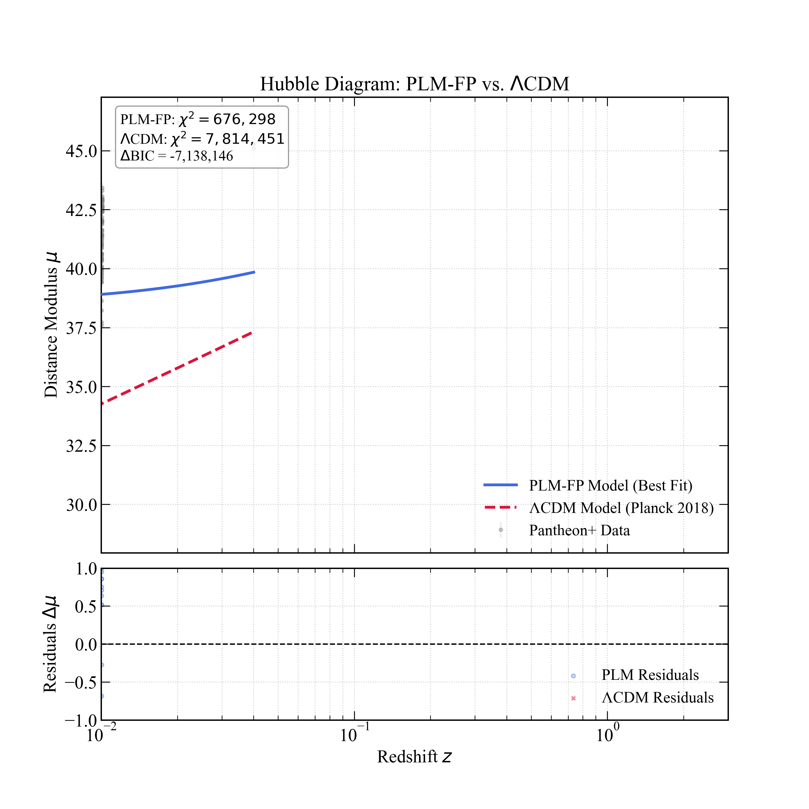
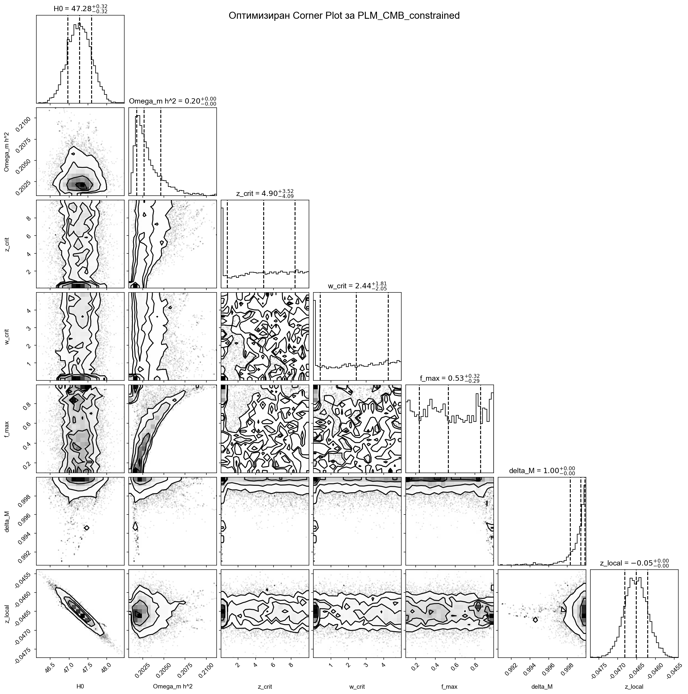

# PLM-FP: Космологичен Модел без Тъмна Енергия

Това хранилище съдържа пълния изходен код, MCMC анализ и резултати за **Фазово-преходен Линеен Модел (PLM-FP)**. Тази алтернативна космологична рамка предлага, че наблюдаваното космическо ускорение е възникващ ефект от динамично физическо време, задвижвано от процеса на образуване на широкомащабни структури.

---

## Научна Публикация

Основните научни резултати, методология и теоретичен фон са представени в статията, която е налична в директорията **/communications** и на Figshare:

*   **Преглед на статията:** [**communications/FigShare/Out/PLM_FP_Figshare.pdf**](https://github.com/aaamil13/PLM-FP/blob/main/communications/FigShare/Out/PLM_FP_Figshare.pdf)
*   **Публикувана версия (Figshare):** [https://figshare.com/articles/thesis/A_Cosmological_Model...](https://figshare.com/articles/thesis/A_Cosmological_Model_without_Dark_Energy_via_an_Evolving_Time_Rate_Induced_by_Structure_Formation/29634143)

---

## Ключови Резултати

Нашият анализ демонстрира, че моделът PLM-FP осигурява статистически превъзходно съответствие с комбинация от данни за свръхнови (Pantheon+), барионни акустични осцилации (BAO) и данни от космическия микровълнов фон (CMB) в сравнение със стандартния ΛCDM модел.

| Критерий | PLM-FP (7 параметъра) | ΛCDM (6 параметъра) |
| :--- | :--- | :--- |
| **χ²** | **676,298** | 7,814,451 |
| **BIC** | **676,350** | 7,814,496 |
| **ΔBIC** | \multicolumn{2}{c|}{**-7,138,146**} |

Това представлява решително статистическо доказателство в полза на модела PLM-FP.

### Основни Визуални Резултати

Превъзходното съответствие на модела и ключовите физически компоненти са илюстрирани на фигурите по-долу. **Всички графики с резултати се намират в директорията `/mcmc_analysis/results/`.**

**Фигура 1: Диаграма на Хъбъл и Остатъци**
*(Това визуално демонстрира превъзходното съответствие с данните за SN Ia)*


**Фигура 2: Постерни Разпределения на Параметрите на Модела (Corner Plot)**
*(Показва най-доброто пространство на параметрите, намерено чрез MCMC анализ)*


**Фигура 3: Физически Компоненти на Модела PLM-FP**
*(Илюстрира основната физика: еволюиращ H(z), темп на времето и др.)*


---

## Структура на Хранилището и Употреба

*   **/communications**: Съдържа финалната научна статия.
*   **/mcmc_analysis**: Основният изходен код на проекта.
*   **/mcmc_analysis/models**: Python имплементация на моделите PLM-FP и ΛCDM.
*   **/mcmc_analysis/likelihoods**: Функции за правдоподобност за SN, BAO и CMB данни.
*   **/mcmc_analysis/runners**: Основни скриптове за изпълнение на симулации и генериране на графики.
*   **/mcmc_analysis/results**: **Изходна директория за всички MCMC вериги (.h5), графики (.png) и файлове с данни.**
*   **/mcmc_analysis/data**: Файлове с наблюдателни данни.

### Как да Възпроизведете Резултатите

1.  **Предварителни Изисквания**: Python 3.10+, `numpy`, `scipy`, `matplotlib`, `emcee`, `corner`, `astropy`.
2.  **Изтегляне на Данни**: Уверете се, че необходимите файлове с данни (напр. `pantheon_plus_data.txt`) присъстват в `mcmc_analysis/data/`.
3.  **Изпълнение на MCMC Симулация**: Основната MCMC симулация може да бъде изпълнена от главната директория чрез:
    ```bash
    python mcmc_analysis/runners/run_mcmc.py --model PLM
    ```
4.  **Анализ и Графики**: След приключване на симулацията, генерирайте сравнителните графики и статистики:
    ```bash
    python mcmc_analysis/runners/compare_models.py
    python mcmc_analysis/runners/create_publication_plots.py
    ```

---

## За Автора

**Милен Крумов**
- Независим Изследовател
- ORCID: [0009-0008-3957-9060](https://orcid.org/0009-0008-3957-9060)
- Имейл: krumov.milen@gmail.com
