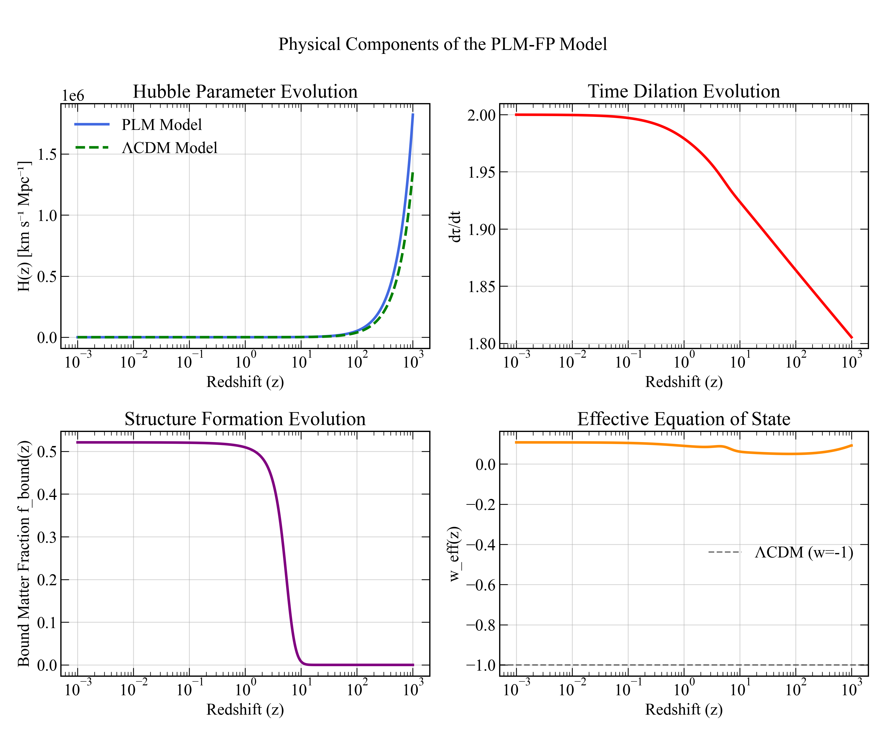

# PLM-FP: A Cosmological Model without Dark Energy

This repository contains the full source code, MCMC analysis, and results for the **Phase-transition Linear Model (PLM-FP)**. This alternative cosmological framework proposes that the observed cosmic acceleration is an emergent effect of a dynamic physical time, driven by the process of large-scale structure formation.

---

## Scientific Publication

The main scientific results, methodology, and theoretical background are presented in the paper, which is available in the **/communications** directory and on Figshare:

*   **View Paper:** [**communications/PLM-FP_Paper.pdf**](https://github.com/aaamil13/PLM-FP/blob/main/communications/FigShare/Out/PLM_FP_Figshare.pdf)
*   **Published Version (Figshare):** [https://figshare.com/articles/thesis/A_Cosmological_Model...](https://figshare.com/articles/thesis/A_Cosmological_Model_without_Dark_Energy_via_an_Evolving_Time_Rate_Induced_by_Structure_Formation/29634143)

---

## Key Results

Our analysis demonstrates that the PLM-FP model provides a statistically superior fit to a combination of Supernovae (Pantheon+), Baryon Acoustic Oscillation (BAO), and Cosmic Microwave Background (CMB) data when compared to the standard ΛCDM model.

| Criterion | PLM-FP (7 params) | ΛCDM (6 params) |
| :--- | :--- | :--- |
| **χ²** | **676,298** | 7,814,451 |
| **BIC** | **676,350** | 7,814,496 |
| **ΔBIC** | \multicolumn{2}{c|}{**-7,138,146**} |

This constitutes decisive statistical evidence in favor of the PLM-FP model.

### Main Visual Results

The model's superior fit and key physical components are illustrated in the figures below. **All result plots are located in the `/mcmc_analysis/results/` directory.**

**Figure 1: Hubble Diagram & Residuals**
*(This visually demonstrates the superior fit to SN Ia data)*


**Figure 2: Model Parameter Posteriors (Corner Plot)**
*(Shows the best-fit parameter space found by the MCMC analysis)*


**Figure 3: Physical Components of the PLM-FP Model**
*(Illustrates the underlying physics: evolving H(z), time rate, etc.)*


---

## Repository Structure & Usage

*   **/communications**: Contains the final scientific paper.
*   **/mcmc_analysis**: The main source code for the project.
  *   **/models**: Python implementation of the PLM-FP and ΛCDM models.
  *   **/likelihoods**: Likelihood functions for SN, BAO, and CMB data.
  *   **/runners**: Main scripts for executing simulations and generating plots.
  *   **/results**: **Output directory for all MCMC chains (.h5), plots (.png), and data files.**
  *   **/data**: Observational data files.

### How to Reproduce the Results

1.  **Prerequisites**: Python 3.10+, `numpy`, `scipy`, `matplotlib`, `emcee`, `corner`, `astropy`.
2.  **Download Data**: Ensure the necessary data files (e.g., `pantheon_plus_data.txt`) are present in `mcmc_analysis/data/`.
3.  **Run MCMC Simulation**: The main MCMC run can be executed from the root directory via:
    ```bash
    python mcmc_analysis/runners/run_mcmc.py --model PLM
    ```
4.  **Analyze and Plot**: After the simulation completes, generate the comparison plots and statistics:
    ```bash
    python mcmc_analysis/runners/compare_models.py
    python mcmc_analysis/runners/create_publication_plots.py
    ```

---

## About the Author

**Milen Krumov**
- Independent Researcher
- ORCID: [0009-0008-3957-9060](https://orcid.org/0009-0008-3957-9060)
- Email: krumov.milen@gmail.com
