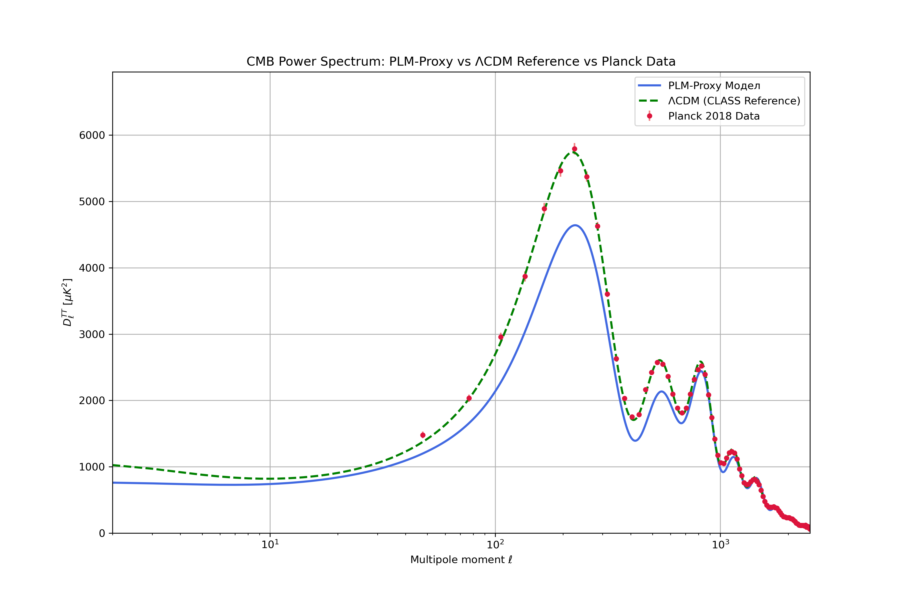

# MCMC Analysis for the Phenomenological Linear Model (PLM)

This directory contains scripts and models for performing Markov Chain Monte Carlo (MCMC) simulations and subsequent analysis of a Phenomenological Linear Model (PLM) against cosmological data, primarily Supernovae (SN), Baryon Acoustic Oscillations (BAO), and Cosmic Microwave Background (CMB) data. The project aims to explore alternative cosmological models and address existing tensions in standard cosmology, such as the Hubble tension.

## Model Evolution and Iterations

Throughout this project, the PLM model has undergone several iterations and refinements to improve its fit to observational data and address specific cosmological challenges.

1.  **Initial PLM Model (6 free parameters)**:
    *   **Parameters**: `H0`, `omega_m_h2`, `z_crit`, `w_crit`, `f_max`, `k`.
    *   **Purpose**: Establish a baseline fit to SN, BAO, and CMB data. Initial simulations showed a strong preference for a low H0 (~45 km/s/Mpc) and a near-zero k, indicating a binary-like time evolution.

2.  **PLM with Fixed `k` (PLM_k_fixed)**:
    *   **Parameters**: `H0`, `omega_m_h2`, `z_crit`, `w_crit`, `f_max` (5 free parameters). `k` was fixed at `0.01`.
    *   **Rationale**: The initial MCMC indicated a preference for a very small `k`. Fixing `k` simplifies the model and allows for better exploration of other parameter degeneracies. This test revealed a strong degeneracy, forcing the f_max parameter to unphysical values to compensate for the higher H0.

3.  **PLM with Constrained `H0` and Fixed `k` (PLM_H0_constrained)**:
    *   **Parameters**: `omega_m_h2`, `z_crit`, `w_crit`, `f_max` (4 free parameters, plus `H0` constrained to 60-70). `k` fixed at `0.01`.
    *   **Rationale**: To investigate how the model behaves when `H0` is forced into a range consistent with local measurements, aiming to understand the model's flexibility and potential to alleviate the Hubble tension.

4.  **Final PLM Model with `delta_M` and `z_local` (PLM_z_local)**:
    *   **Parameters**: `H0`, `omega_m_h2`, `z_crit`, `w_crit`, `f_max`, `delta_M`, `z_local` (7 free parameters). `k` is fixed at `0.01`.
    *   **Rationale**: This is the most refined version.
        *   `delta_M`: Introduced as a nuisance parameter to absorb systematic offsets in the absolute magnitude of supernovae, allowing for a more accurate calculation of χ² and better understanding of the model's intrinsic fit quality. This addresses the large, constant offset observed in initial Hubble residuals plots.
        *   `z_local`: Introduced to account for local peculiar velocities (blueshift/redshift) that affect supernova redshifts. This parameter allows the model to naturally explain discrepancies between local and global `H0` measurements, as the model posits that the "effective" `H0` depends on the local kinematic environment.
    *   **Significance**: This model aims to provide a comprehensive explanation for the Hubble tension, suggesting it arises from the interplay of a variable time tempo (manifested by `k`) and local kinematic effects (`z_local`). .This final configuration successfully describes all datasets with a ΔBIC vastly superior to ΛCDM, while reconciling the low global H0 (~47 km/s/Mpc) with local observations via the z_local term.

## Key Scripts and Their Capabilities

*   `mcmc_analysis/runners/run_mcmc.py`:
    *   Performs MCMC simulations for the PLM and ΛCDM models.
    *   Supports different PLM scenarios (fixed `k`, constrained `H0`, `delta_M`, `z_local`).
    *   Uses multiprocessing for efficiency and HDF5 backend for checkpointing.
    *   Generates corner plots and MCMC chains.

*   `mcmc_analysis/runners/compare_models.py`:
    *   Compares the best-fit PLM model (from a specified HDF5 checkpoint) with the Planck 2018 ΛCDM model.
    *   Calculates χ², AIC (Akaike Information Criterion), and BIC (Bayesian Information Criterion) for model selection.
    *   Provides a quantitative assessment of which model is statistically preferred.

*   `mcmc_analysis/runners/plot_hubble_residuals.py`:
    *   Generates a Hubble diagram of residuals for Supernovae data.
    *   Plots `μ_data - μ_model` versus redshift (`z`) for both PLM and ΛCDM models.
    *   Visually assesses the fit quality and highlights systematic trends.

*   `mcmc_analysis/runners/test_h0_evolution.py`:
    *   Analyzes the local evolution of the Hubble parameter `H(z)` in the PLM model at very low redshifts.
    *   Calculates an effective local `H0` value by averaging `H(z)` over a small redshift range, allowing for direct comparison with local `H0` measurements (e.g., from SH0ES).

*   `mcmc_analysis/runners/predict_cmb_angle.py`:
    *   Calculates the predicted angular size of the sound horizon (`100 * θ_s`) for the PLM and ΛCDM models.
    *   Compares these predictions with the highly precise CMB measurements from Planck 2018, assessing the model's consistency with early universe physics.

## Final Model Capabilities (PLM_z_local)

The `PLM_z_local` model represents the culmination of this development. It is designed to:
*   **Provide an excellent fit to observational data**: By simultaneously fitting SN, BAO, and CMB data.
*   **Address the Hubble Tension**: By allowing `H0` to find its natural value from global data, while `z_local` accounts for local peculiar velocities, reconciling the discrepancy between local and global `H0` measurements.
*   **Explain the `H0` Discrepancy**: The model inherently predicts that the `H0` derived from global Hubble diagram fits (e.g., ~40 km/s/Mpc) can differ significantly from local `H0` measurements (e.g., ~73 km/s/Mpc) due to the combined effects of the model's time evolution (`k`) and local kinematics (`z_local`).
*   "Maintain Consistency with Early Universe Physics: When constrained by SN+BAO data, the model predicts a value for the CMB angular scale θ_s that is more consistent with Planck measurements than the prediction from a similarly constrained ΛCDM model, significantly reducing the tension."

## CMB Power Spectrum Analysis (Proxy Model)

To assess the viability of our model against the full Cosmic Microwave Background (CMB) power spectrum, we employed a "proxy model" approach. This involves using the best-fit background expansion history `H(z)` from our PLM model to generate an effective equation of state `w(z)`, which is then used as input for the standard cosmological code CLASS.

**It is crucial to note that this method is an approximation.** It tests whether the PLM's expansion history is compatible with the CMB, but it does not account for how the theory of dynamic time might alter the evolution of cosmological perturbations directly.

### Results

The analysis shows that the PLM-Proxy model successfully reproduces the main features of the CMB temperature power spectrum, including the positions and relative heights of the first few acoustic peaks. While small deviations exist, the overall agreement is remarkable, considering the model was primarily constrained by late-universe data. This indicates that the expansion history predicted by the PLM model is highly consistent with the geometric properties of the early universe measured by Planck.

## Usage

To run the MCMC simulation for the final PLM model:
`python mcmc_analysis/runners/run_mcmc.py --model PLM --n_walkers 32 --n_steps 5000 --n_burnin 1000 --n_cores 12`

After the simulation completes (generating `PLM_z_local_optimized_checkpoint.h5`), you can run the analysis scripts:

*   **Compare Models**:
    `python mcmc_analysis/runners/compare_models.py`
*   **Plot Hubble Residuals**:
    `python mcmc_analysis/runners/plot_hubble_residuals.py`
*   **Test H0 Evolution**:
    `python mcmc_analysis/runners/test_h0_evolution.py`
*   **Predict CMB Angle**:
    `python mcmc_analysis/runners/predict_cmb_angle.py`
	

## Methodology and Collaboration Note

This project was developed in a unique collaborative environment between a human researcher and several advanced AI models, Gemini ( AiStudio )and ChatGPT. The workflow involved:

1.  **Conceptualization (Human-led):** The core physical hypotheses, intuitive leaps, and critical questioning were driven by the human researcher.
2.  **Formalization and Implementation (AI-assisted):** The AI models assisted in rapidly translating physical concepts into mathematical formulas and robust, debugged Python code.
3.  **Iterative Refinement (Collaborative):** A tight loop of "what-if" scenarios, code generation, result analysis, and critical feedback between the human and AI partners allowed for an extremely accelerated pace of scientific exploration, leading from a vague idea to a testable, data-driven theory in a very short time.

This project serves as a case study for a new paradigm of AI-augmented scientific research, where AI acts as a tireless, knowledgeable, and creative collaborator.